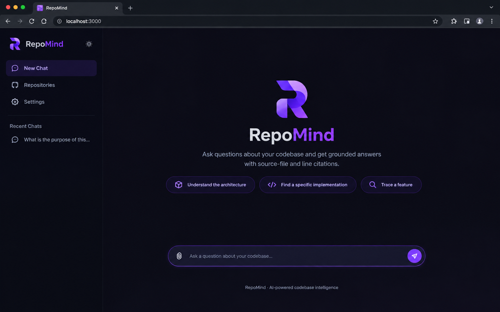

# RepoMind

## UI Preview




### AI Codebase Intelligence System powered by RAG

**RepoMind** is an AI-powered codebase intelligence system that allows developers to understand unfamiliar software repositories through natural-language questions.

Instead of sending an entire repository to an LLM, RepoMind builds a retrieval pipeline specifically designed for source code:

**Repository → Code-aware chunks → Embeddings → Hybrid retrieval → Reranking → Grounded generation → Source citations**

The goal is simple:

> **Give developers accurate, traceable answers about a codebase without relying on the LLM to guess.**

---

## ✨ Why RepoMind?

Large language models are good at reasoning about code, but giving an LLM an entire repository creates several problems:

* Context windows are limited.
* Relevant files may be buried among hundreds of irrelevant ones.
* Exact identifiers and function names are difficult to retrieve using semantic search alone.
* Large contexts increase latency and cost.
* Generated answers can contain unsupported claims.
* Developers need to know **where an answer came from**.

RepoMind addresses these problems with a retrieval-first architecture combining:

* AST-based code-aware chunking
* Dense vector search
* Keyword search
* Hybrid retrieval with Reciprocal Rank Fusion (RRF)
* Cross-encoder reranking
* Context construction with file and line metadata
* Grounded LLM generation
* Source citations
* Conversation history
* Retrieval evaluation

---

# 🏗️ Architecture

```text
                         ┌─────────────────────┐
                         │   GitHub Repository  │
                         └──────────┬──────────┘
                                    │
                                    ▼
                         ┌─────────────────────┐
                         │  Repository Loader  │
                         │ GitHub / ZIP        │
                         └──────────┬──────────┘
                                    │
                                    ▼
                         ┌─────────────────────┐
                         │ File Discovery &    │
                         │ Filtering           │
                         └──────────┬──────────┘
                                    │
                                    ▼
                         ┌─────────────────────┐
                         │ Code-Aware Chunking │
                         │ AST-based           │
                         └──────────┬──────────┘
                                    │
                                    ▼
                         ┌─────────────────────┐
                         │ Embedding Generation│
                         │ all-mpnet-base-v2   │
                         └──────────┬──────────┘
                                    │
                                    ▼
                    ┌───────────────────────────────┐
                    │ PostgreSQL + pgvector + HNSW │
                    └───────────────┬───────────────┘
                                    │
                                    │
                          ┌─────────▼─────────┐
                          │   User Question   │
                          └─────────┬─────────┘
                                    │
                                    ▼
                          ┌───────────────────┐
                          │   Query Routing   │
                          └─────────┬─────────┘
                                    │
                       ┌────────────┴────────────┐
                       ▼                         ▼
              ┌────────────────┐        ┌────────────────┐
              │ Semantic Search│        │ Keyword Search │
              └───────┬────────┘        └───────┬────────┘
                      │                         │
                      └────────────┬────────────┘
                                   ▼
                         ┌─────────────────────┐
                         │   Hybrid Retrieval  │
                         │        + RRF         │
                         └──────────┬──────────┘
                                    │
                                    ▼
                         ┌─────────────────────┐
                         │ Cross-Encoder       │
                         │ Reranking           │
                         └──────────┬──────────┘
                                    │
                                    ▼
                         ┌─────────────────────┐
                         │ Context Builder     │
                         │ File + line metadata│
                         └──────────┬──────────┘
                                    │
                                    ▼
                         ┌─────────────────────┐
                         │ Gemini LLM          │
                         │ Grounded Generation │
                         └──────────┬──────────┘
                                    │
                                    ▼
                         ┌─────────────────────┐
                         │ Answer + Citations  │
                         └─────────────────────┘
```

---

# 🔍 Core Retrieval Pipeline

RepoMind is not simply "an LLM connected to a vector database."

The retrieval pipeline contains several stages, each solving a different problem.

### 1. Repository ingestion

Repositories can be loaded from:

* GitHub URLs
* ZIP archives

The loader creates an isolated temporary workspace before processing the repository.

---

### 2. File discovery and filtering

The ingestion layer scans the repository and filters irrelevant content such as:

* `.git`
* virtual environments
* `node_modules`
* build directories
* generated artifacts
* binary/media files
* archives

This prevents irrelevant data from entering the retrieval index.

---

### 3. Code-aware chunking

Instead of blindly splitting source files by character count, RepoMind uses Python's AST to identify top-level code structures such as:

* imports
* functions
* classes

Each chunk keeps metadata including:

```text
file path
filename
language
start line
end line
content
```

This makes retrieved results easier to understand and allows generated answers to reference the original source location.

---

### 4. Embeddings

Each code chunk is converted into a vector representation using:

**`sentence-transformers/all-mpnet-base-v2`**

Embedding dimension:

```text
768
```

The vectors are stored directly in PostgreSQL through `pgvector`.

---

# 🗄️ PostgreSQL + pgvector

RepoMind uses PostgreSQL as the primary persistence layer.

`pgvector` provides vector storage and similarity search directly inside PostgreSQL.

The system also uses **HNSW** indexing for efficient approximate nearest-neighbor retrieval.

Conceptually:

```text
Repository
   │
   ├── Files
   │      │
   │      └── Chunks
   │              │
   │              └── 768-dimensional embedding
   │
   └── Conversations
           │
           └── Messages
```

This keeps repository metadata, source chunks, embeddings, and conversation history in one database system.

---

# 🔎 Hybrid Retrieval

Semantic search alone is not enough for code.

For example, a query such as:

```text
Where is `ConversationManager` instantiated?
```

contains an exact identifier that keyword matching can retrieve extremely well.

On the other hand:

```text
How does RepoMind remember previous questions?
```

is more semantic and benefits from vector search.

RepoMind therefore combines two retrieval strategies.

### Semantic Search

Uses embedding similarity to find conceptually relevant code.

Useful for questions such as:

```text
How does conversation history work?
```

### Keyword Search

Finds exact lexical matches.

Useful for:

```text
Where is RAGPipeline created?
```

### Hybrid Search

The results from both retrieval methods are combined using:

**Reciprocal Rank Fusion (RRF)**

This produces a ranking that benefits from both:

```text
semantic understanding
        +
exact code matching
        ↓
better retrieval
```

---

# 🎯 Reranking

Initial retrieval is optimized for recall.

RepoMind then applies a second-stage **cross-encoder reranker** to improve the ordering of the retrieved candidates.

The pipeline becomes:

```text
Query
  ↓
Semantic Search ──┐
                  ├──→ RRF → Candidate Results
Keyword Search ───┘
                         ↓
                     Reranker
                         ↓
                 Top Relevant Context
```

This separates:

* **candidate retrieval**
* **relevance scoring**

instead of relying on a single retrieval mechanism.

---

# 🧠 Grounded Generation

After retrieval, RepoMind constructs a structured context containing the selected source chunks.

Example:

```text
--- Source 1 ---
File: app/ingestion/rag/pipeline.py
Lines: 42-67

<retrieved source code>
```

The LLM receives this retrieved context and is instructed to:

* answer using repository evidence
* avoid inventing files or functions
* clearly state when the available context is insufficient
* provide source citations for repository-based claims

The result is a **grounded answer rather than an unrestricted LLM response**.

---

# 📌 Source Citations

Repository answers include source information such as:

```text
src/main.py:1-1
```

This gives the developer a way to trace an answer back to the original code.

The citation pipeline is:

```text
Retrieved Chunk
      ↓
File Path + Line Range
      ↓
Context Builder
      ↓
LLM
      ↓
Grounded Answer
      ↓
Source Citation
```

Traceability is a core design goal of RepoMind.

---

# 💬 Conversation History

RepoMind also persists conversations and messages.

This allows follow-up questions to use previous conversational context.

For example:

```text
User:
How is authentication implemented?

RepoMind:
...

User:
Where is that logic called?

RepoMind:
...
```

The conversation layer provides context without treating conversation history as a substitute for repository retrieval.

Repository facts still need to come from retrieved repository context.

---

# 📊 Evaluation

RepoMind includes a labeled retrieval evaluation set containing **30 queries**.

Current evaluation result:

| Metric             |    Result |
| ------------------ | --------: |
| Correct retrievals |   26 / 30 |
| Retrieval accuracy | **86.7%** |

The evaluation was used to iterate on:

* retrieval strategy
* query routing
* hybrid search
* ranking behavior

The purpose is not to claim perfect retrieval, but to have a measurable way to identify retrieval failures.

---

# 🌐 REST API

RepoMind exposes a lightweight Flask API.

### Health

```http
GET /health
```

Returns the service status.

### Create repository

```http
POST /repositories
```

Ingests a repository and creates its database representation.

### Create conversation

```http
POST /conversations
```

Creates a persistent conversation.

### Ask a question

```http
POST /chat
```

Example request:

```json
{
  "repository_id": 1,
  "conversation_id": 1,
  "question": "How does hybrid retrieval work?"
}
```

Example response:

```json
{
  "answer": "...",
  "repository_id": 1
}
```

---

# 🧪 Testing

RepoMind includes API tests covering:

* health checks
* validation errors
* repository creation
* successful chat requests
* invalid conversation handling
* missing required fields

Current test result:

```text
7 passed
```

The project is also checked with Python compilation:

```bash
python -m compileall -q app
```

And whitespace / patch validation:

```bash
git diff --check
```

---

# 🐳 Docker

RepoMind can be run using Docker Compose.

The stack contains:

```text
┌───────────────────┐
│   RepoMind App    │
│     Flask API     │
└─────────┬─────────┘
          │
          ▼
┌───────────────────┐
│    PostgreSQL     │
│     + pgvector    │
└───────────────────┘
```

Build:

```bash
docker compose build
```

Start:

```bash
docker compose up -d
```

Check services:

```bash
docker compose ps
```

Health check:

```bash
curl http://localhost:5000/health
```

Expected:

```json
{
  "service": "RepoMind",
  "status": "ok"
}
```

---

# ⚙️ Local Development

### 1. Clone

```bash
git clone https://github.com/Mohammed18-19/RepoMind.git
cd RepoMind
```

### 2. Create a virtual environment

```bash
python -m venv venv
source venv/bin/activate
```

### 3. Install dependencies

```bash
pip install -r requirements.txt
```

### 4. Configure environment variables

Copy:

```bash
cp .env.example .env
```

Then configure:

```env
DATABASE_URL=your_database_url_here
GEMINI_API_KEY=your_gemini_api_key_here
```

### 5. Run

```bash
python -m app.main
```

For the most reproducible setup, Docker Compose is recommended.

---

# 📁 Project Structure

```text
RepoMind/
│
├── app/
│   ├── ingestion/
│   │   ├── rag/
│   │   ├── repository_loader.py
│   │   ├── file_discovery.py
│   │   ├── code_chunker.py
│   │   ├── chunk_storage.py
│   │   └── ...
│   │
│   ├── database.py
│   ├── models.py
│   ├── main.py
│   └── logging_config.py
│
├── evaluation/
│
├── tests/
│
├── Dockerfile
├── docker-compose.yml
├── requirements.txt
├── .env.example
├── .gitignore
├── LICENSE
└── README.md
```

---

# 🛠️ Tech Stack

| Layer            | Technology                  |
| ---------------- | --------------------------- |
| Language         | Python                      |
| API              | Flask                       |
| LLM              | Gemini                      |
| Embeddings       | Sentence Transformers       |
| Embedding Model  | `all-mpnet-base-v2`         |
| Vector Database  | PostgreSQL + pgvector       |
| Vector Index     | HNSW                        |
| Retrieval        | Semantic + Keyword + Hybrid |
| Fusion           | Reciprocal Rank Fusion      |
| Reranking        | Cross-Encoder               |
| Database ORM     | SQLAlchemy                  |
| Testing          | pytest                      |
| Containerization | Docker + Docker Compose     |
| Version Control  | Git / GitHub                |

---

# 🎯 Design Goals

RepoMind was built around several principles.

### Retrieval before generation

The LLM should reason over retrieved evidence rather than receive an uncontrolled repository dump.

### Code-aware data representation

Source code has structure. The retrieval system should preserve that structure instead of treating everything as plain text.

### Hybrid retrieval

Semantic similarity and exact identifier matching solve different problems. Code search benefits from both.

### Reranking

Initial retrieval should prioritize recall, while reranking improves the quality of the final context.

### Grounded answers

The model should answer from repository evidence and explicitly acknowledge when the evidence is insufficient.

### Traceability

Answers should point developers back to the source code that supports them.

### Measurability

Retrieval quality should be evaluated instead of assumed.

### Simplicity

RepoMind intentionally avoids unnecessary infrastructure and focuses on the core code intelligence pipeline.

---

# ⚠️ Current Limitations

RepoMind is a portfolio-focused engineering project rather than a full commercial developer platform.

Current limitations include:

* The code-aware chunker currently focuses on top-level AST structures.
* Retrieval evaluation is based on a relatively small labeled dataset.
* The API does not currently include authentication or authorization.
* The system is not designed for distributed production-scale workloads.
* There is no dedicated frontend application.
* Repository ingestion is currently designed around the supported ingestion workflow rather than continuous synchronization.

These are deliberate boundaries rather than hidden assumptions.

---

# 🚀 Future Improvements

Possible future directions include:

* More advanced code-aware chunking
* Larger evaluation datasets
* Additional programming-language parsers
* Improved retrieval evaluation metrics
* Repository synchronization
* Authentication and authorization
* Dedicated web interface
* Production deployment
* Observability and monitoring
* More advanced codebase reasoning

These are intentionally outside the current core scope.

---

# 🔐 Security & Configuration

Secrets should never be committed to the repository.

RepoMind uses:

```text
.env
```

for local configuration and provides:

```text
.env.example
```

with safe placeholders.

The real `.env` file is excluded from version control.

---

# 📈 What This Project Demonstrates

RepoMind demonstrates practical understanding of an end-to-end AI engineering system rather than only LLM API usage.

### AI / RAG

* Retrieval-Augmented Generation
* Embeddings
* Vector search
* Hybrid retrieval
* Reciprocal Rank Fusion
* Reranking
* Context construction
* Grounded generation
* Retrieval evaluation

### Backend Engineering

* Flask REST APIs
* PostgreSQL
* SQLAlchemy
* pgvector
* Persistent conversation state
* Error handling
* Structured logging
* Automated tests

### Infrastructure

* Docker
* Docker Compose
* Environment configuration
* Reproducible local setup
* Git-based development workflow

---

# 🧩 Engineering Takeaway

The central idea behind RepoMind is not simply:

> "Connect an LLM to a vector database."

It is:

> **Design a retrieval system that can identify the right pieces of a codebase, rank them effectively, preserve their source information, and provide that evidence to an LLM in a controlled way.**

That distinction is what makes RepoMind a **codebase intelligence system** rather than a basic chatbot.

---

# 📜 License

This project is licensed under the **MIT License**.

---

## 👤 Author

**Mohammed Ain Tomar**

AI Engineer · Backend Developer · RAG & LLM Systems

* GitHub: [Mohammed18-19](https://github.com/Mohammed18-19)
* LinkedIn: [Mohammed Ain Tomar](https://linkedin.com/in/mohammed-aintomar-a94a37262)

---

<p align="center">
  Built to understand codebases — not just generate code.
</p>
